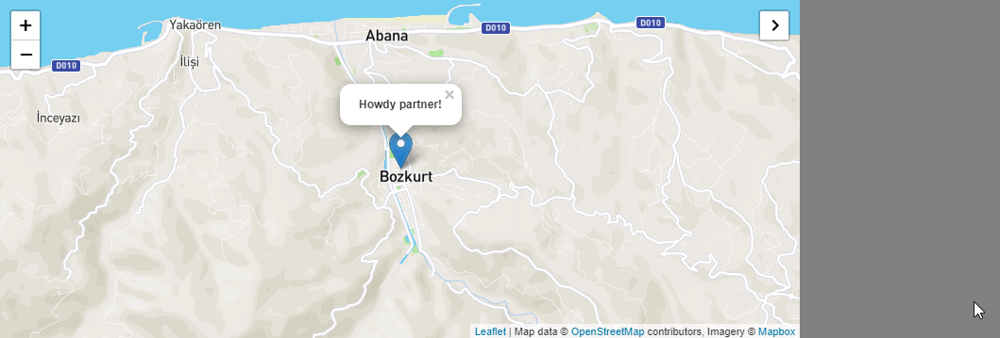

## Leaflet Collapse Button
A HTML5 collapse button plugin for Leaflet.

[](https://www.npmjs.com/package/leaflet-collapse-button)

<a href="https://jsfiddle.net/muhammedkalender/d9g8j3w7/">View Demo</a>



### Usage

``` js
map.addControl(new L.Control.CollapseButton ({
	currentStatus: 1,	
	position: 'topright',	
	title: 'Hide Panel',	
	titleCancel: 'Show Panel',	
	elementId: 'map',	
	targetElementId: 'cards',	
	hideClasses: 'col-md-12',	
	showClasses: 'col-md-8',	
	targetHideClasses: 'hidden',	
	targetShowClasses: 'col-md-4'
}));
```

### Including via CDN

```html
<script src="https://cdn.jsdelivr.net/npm/leaflet-collapse-button@0.0.4/dist/leaflet.collapse-button.min.js"></script>
<link rel="stylesheet" href="https://cdn.jsdelivr.net/npm/leaflet-collapse-button@0.0.4/dist/leaflet.collapse-button.min.css">
```

### Install via NPM
```html
npm i leaflet-collapse-button
```
